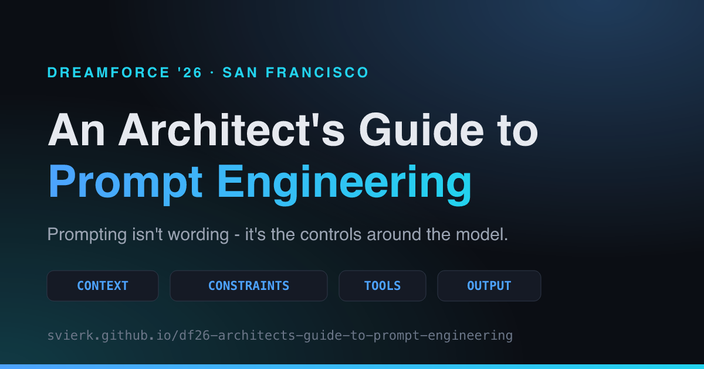

# Architects' Guide to Prompt Engineering

🧭 Session asset for **"An Architect's Guide to Prompt Engineering"** - Dreamforce '26, San Francisco.

**→ [svierk.github.io/df26-architects-guide-to-prompt-engineering](https://svierk.github.io/df26-architects-guide-to-prompt-engineering/)**

<p align="center">
  
</p>

## What this is

The complete session on a single page, written to stand on its own for anyone who arrives at the link without any other context:

| Section                | What you get                                                                                                                                              |
| ---------------------- | --------------------------------------------------------------------------------------------------------------------------------------------------------- |
| **The problem**        | Why a Salesforce org - a running system, not a metadata dump - breaks an unstructured prompt                                                              |
| **Four control moves** | Context, Constraints, Tools, Output + Evaluation                                                                                                          |
| **The protocol**       | The copy-and-paste skeleton that packages all four into one prompt                                                                                        |
| **Prompt builder**     | Fill the four control moves, watch the prompt assemble, and get scored against the six rules - live, in your browser                                      |
| **Three demos**        | Org merger, order-sync cutover and FSC metadata governance - each shown as an unstructured prompt vs. a structured protocol, with the artifact it returns |
| **Six rules**          | The field guide, each rule traced back to the example it came from                                                                                        |

The prompt builder keeps your draft in `localStorage` - nothing is sent anywhere, and there is no analytics or tracking on the page.

## Session objectives

Apply prompt engineering techniques that incorporate context, constraints, tools and output design to create reliable interactions for Salesforce architecture and development.

1. Design prompts using context, constraints, tools and structured outputs.
2. Use better prompts to drive real system behaviour, not just generate content.
3. Apply patterns that produce consistent, repeatable results from AI in Salesforce.

## Development

```bash
npm install      # install dependencies
npm run dev      # start the dev server on localhost:4321
npm run build    # production build into dist/
npm run preview  # preview the production build
```

Formatting is checked in CI:

```bash
npm run prettier         # format
npm run prettier:verify  # list files that would change
```

### Regenerating the social preview

`public/og-image.png` is committed and only needs regenerating when the session title or the published URL changes:

```bash
npm run og:generate
```

### Where the content lives

All session content sits in typed data files, separate from the presentation layer - editing a rule or a demo never means touching a component:

```
src/data/session.ts   session metadata, speakers, objectives
src/data/problem.ts   symptoms, architect questions, root causes
src/data/controls.ts  the four control moves + protocol skeleton lines
src/data/demos.ts     the three worked examples and their result artifacts
src/data/rules.ts     the six rules of the field guide
```

The readiness check in the builder lives in `src/components/PromptBuilder.astro` - one heuristic per rule, deliberately simple and readable.

## Deployment

Every push to `main` builds the site and publishes it to GitHub Pages via [`.github/workflows/deploy.yml`](.github/workflows/deploy.yml). Pull requests are validated by [`.github/workflows/ci.yml`](.github/workflows/ci.yml).

## Speakers

- [Chetan Chugh](https://www.linkedin.com/in/chetan-chugh-18264b34/) - Chief Architect & Salesforce CTA, Capgemini
- [Sebastiano Schwarz](https://www.linkedin.com/in/sebastiano-schwarz/) - Salesforce CTO Germany, Capgemini

## License

[MIT](LICENSE) - take the protocol, the rules and the page structure and reuse them in your own sessions.
